# Lingtrain Aligner

[](https://pypi.org/project/lingtrain-aligner)
[](https://pepy.tech/project/lingtrain-aligner)

**Lingtrain Aligner** is a powerful, ML-powered library for accurately aligning texts in different languages. It's designed to build parallel corpora from two or more raw texts, even when they have different structures.


## Key Features

- **Automated Alignment:** Uses multilingual machine learning models to automatically match sentence pairs.
- **Conflict Resolution:** Intelligently handles cases where one sentence is translated as multiple sentences, or vice-versa.
- **Multiple Output Formats:** Generates parallel corpora as separate plain text files or as a merged TMX file for use in translation memory tools.
- **Flexible Model Support:** Supports a variety of sentence embedding models, allowing you to choose the best one for your language and performance needs.


## Project Structure

```mermaid
%%──────────────────────────  GLOBAL THEME  ──────────────────────────%%
%%{ init: {
     "theme": "base",
     "themeVariables": {
       "fontFamily": "Inter, Roboto, Helvetica, Arial, sans-serif",
       "primaryColor":        "#3F51B5",
       "primaryBorderColor":  "#303F9F",
       "primaryTextColor":    "#FFFFFF",
       "clusterBkg":          "#E8EAF6",
       "clusterBorder":       "#3F51B5",
       "lineColor":           "#303F9F"
     }
   }
}%%

flowchart TD
    %%────────────────────────  N O D E S  ────────────────────────%%
    A["<fa:fa-play>  Start"]:::start

    subgraph "Pre-processing"
        direction TB
        B["<fa:fa-cut>  Splitter<br/>(splitter.py)"]:::process
        C["<fa:fa-broom>  Preprocessor<br/>(preprocessor.py)"]:::process
    end

    subgraph "Alignment & Embeddings"
        direction TB
        D["<fa:fa-align-left>  Aligner<br/>(aligner.py)"]:::core
        E["<fa:fa-brain>  Embedding Dispatcher<br/>(model_dispatcher.py)"]:::model
        F["<fa:fa-laptop-code>  Transformers / API<br/>(sentence_transformers_models.py<br/>or api_request_parallel_processor.py)"]:::model
    end

    subgraph "Persistence & Post-processing"
        direction TB
        G["<fa:fa-database>  Persist<br/>(helper.py)"]:::storage
        H["<fa:fa-exchange-alt>  Conflict Resolver<br/>(resolver.py)"]:::decision
        I["<fa:fa-check>  Corrector<br/>(corrector.py)"]:::process
        J["<fa:fa-save>  Saver<br/>(saver.py)"]:::process
        K["<fa:fa-file-export>  TMX / JSON etc."]:::output
    end

    subgraph "Visualisation"
        direction TB
        L["<fa:fa-chart-bar>  Visualiser<br/>(vis_helper.py)"]:::visual
        M["<fa:fa-image>  Alignment Images"]:::output
    end

    %%────────────────────────  E D G E S  ────────────────────────%%
    A --> B
    B --> C
    C --> D
    D --> E
    E --> F
    D --> G
    G --> H
    H --> I
    I --> J
    J --> K
    D --> L
    L --> M

    %%────────────────────────  S T Y L E S  ──────────────────────%%
    classDef start     fill:#4FC3F7,stroke:#0288D1,stroke-width:2px,color:#fff,font-weight:bold;
    classDef process   fill:#AED581,stroke:#7CB342,stroke-width:2px;
    classDef decision  fill:#FFB74D,stroke:#F57C00,stroke-width:2px;
    classDef core      fill:#E57373,stroke:#D32F2F,stroke-width:3px,font-weight:bold;
    classDef storage   fill:#8D6E63,stroke:#5D4037,stroke-width:2px,color:#fff;
    classDef model     fill:#9575CD,stroke:#512DA8,stroke-width:2px,color:#fff;
    classDef output    fill:#B0BEC5,stroke:#546E7A,stroke-width:2px;
    classDef visual    fill:#81D4FA,stroke:#0288D1,stroke-width:2px;

    class A start;
    class B,C,I,J process;
    class D core;
    class E,F model;
    class G storage;
    class H decision;
    class K,M output;
    class L visual;

```



## Getting Started

### Installation

To get started with Lingtrain Aligner, install the library from PyPI:

```bash
pip install lingtrain-aligner
```

## Supported Models

Lingtrain Aligner supports several multilingual models, each with its own strengths:

| Model | Key Features | Size | Supported Languages |
|---|---|---|---|
| **distiluse-base-multilingual-cased-v2** | Fast and reliable | 500MB | 50+ |
| **LaBSE** | Ideal for rare languages | 1.8GB | 100+ |
| **SONAR** | Supports a vast number of languages | 3GB | ~200 |

## How It Works

The alignment process faces several challenges, such as:

- **Structural Differences:** Translators may merge or split sentences.
- **Service Marks:** Texts often contain page numbers, chapter headings, and other non-content elements.

Lingtrain Aligner addresses these issues by:

1. **Preprocessing:** Cleaning and preparing the texts for alignment.
2. **Sentence Embedding:** Using a selected model to create vector representations of each sentence.
3. **Similarity Matching:** Comparing sentence vectors to find the best matches.
4. **Conflict Resolution:** Applying algorithms to resolve alignment conflicts.

The result is a high-quality parallel corpus suitable for machine translation research, linguistic analysis, or creating bilingual reading materials.

## Contributing

Contributions are welcome! If you have any ideas, suggestions, or bug reports, please open an issue on the [GitHub repository](https://github.com/averkij/lingtrain-aligner).

## ⚡ Articles

-  👅 [Язык твой — друг твой. Развиваем малые языки](https://habr.com/ru/articles/791188/)
-  🔥 [Lingtrain Studio. Книги для всех, даром](https://habr.com/ru/company/ods/blog/669990/)
-  🧩 [How to create bilingual books. Part 2. Lingtrain Alignment Studio](https://medium.com/@averoo/how-to-create-bilingual-books-part-2-lingtrain-alignment-studio-ffa56c9c07a6)
-  📘 [How to make a parallel texts for language learning. Part 1. Python and Colab version](https://medium.com/@averoo/how-to-make-a-parallel-book-for-language-learning-part-1-python-and-colab-version-cff09e379d8c)
-  🔮 [Lingtrain Aligner. Приложение для создания параллельных книг, которое вас удивит](https://habr.com/ru/post/564944/)
-  📌 [Сам себе Гутенберг. Делаем параллельные книги](https://habr.com/ru/post/557664/)


## License

This project is licensed under the GNU General Public License v3 (GPLv3). See the [LICENSE](LICENSE) file for more details.
